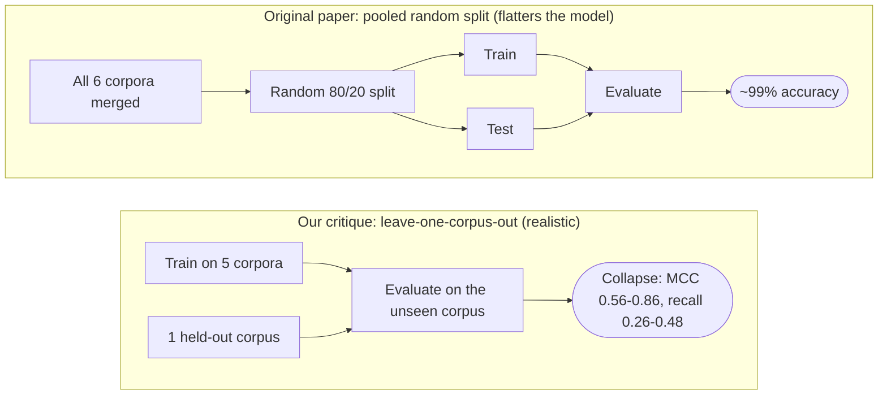

# 🎣 Phishing Detection — A Critical Evaluation of a "99% Accuracy" Claim


> **A published phishing detector reports 99.1% accuracy. We reproduce it exactly — then show
> it misses up to ~74% of phishing from an email source it wasn't trained on.** A case study in
> how in-distribution benchmarks overstate real-world security performance.

*Final project — Using Data Science Methods in Cybersecurity, University of Haifa (Dr. Uri Itai).*

---

## TL;DR

We critically evaluate **[arXiv:2405.11619](https://arxiv.org/abs/2405.11619)** (TF-IDF + Linear
SVM on the six-corpus *Phish No More* dataset). The headline reproduces — and even the metrics
the authors omitted (MCC, ROC-AUC) look great **in-distribution**. But the paper never tests
**generalization**. When we do, the story changes:

| Evaluation | Result | What it means |
|---|---|---|
| **Reproduced (pooled split)** | Acc **0.9905**, F1 0.9909, MCC 0.9811, ROC-AUC 0.9994 | The claim is real *on this split* |
| **Leave-one-corpus-out (MCC)** | **0.56–0.86** vs 0.98 | Collapses on unseen sources — *across all 4 models* |
| **Recall on unseen Nazario phishing** | **0.26–0.48** | Misses **half or more** of real phishing from a new source |
| **Predict the *corpus* from text** | **95.8%** accuracy | The model can read *source*, not just phishing |
| **Precision @ realistic 5% prevalence** | 0.83 in-dist → **0.14** cross-corpus | Out of distribution, most alerts are false alarms |

**Verdict:** the claim is *reproducible*, but the conclusion of real-world efficacy is
**overstated** — the model substantially learns *source and era artifacts*, not generalizable
phishing semantics.

---

## The one figure that tells the story

Train on every corpus but one, test on the held-out (unseen) source. In-distribution MCC is
~0.98; cross-corpus it collapses — and it's **model-agnostic**, so it's the data/task, not the
classifier:


Why? Because the corpora are easy to tell apart by text alone (the dataset stitches together
distinct sources), and most "legitimate" signal is really *"looks like the Enron corpus."*

| The dataset is source-confounded… | …so honest prevalence bites out-of-distribution |
|---|---|
|  |  |

---

## Why the evaluation matters: pooled vs. cross-corpus

The flaw is methodological. The original paper evaluates on a **random pooled split** (which
flatters the model); we test **generalization to an unseen source**:



## What we did

1. **Reproduce** the paper's TF-IDF + Linear SVM pipeline (and 3 more models) — confirm ~99%.
2. **Quantify the confound** (Cramér's V = 0.31 — *not* a trivial corpus = label leak).
3. **Provenance classifier** — predict the corpus from text (95.8%).
4. **Token autopsy** — the model's top weights are era/source artifacts (`enron`, `2004`, `2005`).
5. **Leave-one-corpus-out** across 4 models — the decisive generalization test.
6. **Temporal split** (within CEAS) and **realistic-prevalence** re-evaluation.
7. **Honest metrics** throughout: F1, Fβ, **MCC**, **ROC-AUC**, confusion matrices, error analysis.

📄 **Full analysis: [`report/report.pdf`](report/report.pdf)** · 📓 **Notebook: [`notebooks/phishing_critique.ipynb`](notebooks/phishing_critique.ipynb)**

---

## Repository layout

```
report/report.pdf            Full written report (8 sections)
notebooks/phishing_critique.ipynb   Complete, executable, documented analysis
src/        config · data · features · models · evaluate · critique · plots
figures/    All generated figures (embedded above and in the report)
tests/      Sanity tests for the data loaders
docs/       REQUIREMENTS_CHECKLIST.md · KNOWN_LIMITATIONS.md
```

## Links
- **Source under evaluation:** Al-Subaiey et al., *"Novel Interpretable and Robust Web-based AI
  Platform for Phishing Email Detection"* — https://arxiv.org/abs/2405.11619
- **Original implementation:** the paper publishes no training-code repository; it provides the
  dataset and a described TF-IDF + SVM pipeline (reproducibility is analyzed in the report, §4).
- **Dataset source:** "Phishing Email Dataset" (*Phish No More*), Kaggle —
  https://www.kaggle.com/datasets/naserabdullahalam/phishing-email-dataset

## Citation
BibTeX for the source paper under evaluation:

```bibtex
@misc{alsubaiey2024phishing,
  title         = {Novel Interpretable and Robust Web-based AI Platform for Phishing Email Detection},
  author        = {Al-Subaiey, Abdulla and Al-Thani, Mohammed and Alam, Naser Abdullah and
                   Antora, Kaniz Fatema and Khandakar, Amith and Zaman, SM Ashfaq Uz},
  year          = {2024},
  eprint        = {2405.11619},
  archivePrefix = {arXiv},
  primaryClass  = {cs.LG}
}
```

## Execution instructions
Requires Python 3.11.

```bash
# 1. Environment
python -m venv .venv
source .venv/Scripts/activate        # Windows (Git Bash); use .venv/bin/activate on macOS/Linux
pip install -r requirements.txt

# 2. Get the data (needs a free Kaggle account / API token)
python -c "from src.data import download_data; download_data()"
#    Manual fallback: download from the Kaggle link above and unzip the CSVs into data/raw/.

# 3. Run the analysis
jupyter notebook notebooks/phishing_critique.ipynb
```

Run the tests with `pytest`, and the linter with `ruff check src tests`.

## Rebuilding the report (optional)
The PDF is committed at [`report/report.pdf`](report/report.pdf). To regenerate it from
`report/report.md` you need [Pandoc](https://pandoc.org) and any LaTeX engine (Tectonic, MiKTeX,
or TeX Live):

```bash
pandoc report/report.md -o report/report.pdf --resource-path=report --pdf-engine=<engine>
```

## Author
**Imree Cohen** — completed for *Using Data Science Methods in Cybersecurity*, University of Haifa
(instructor: Dr. Uri Itai).

## License
See [LICENSE](LICENSE).
