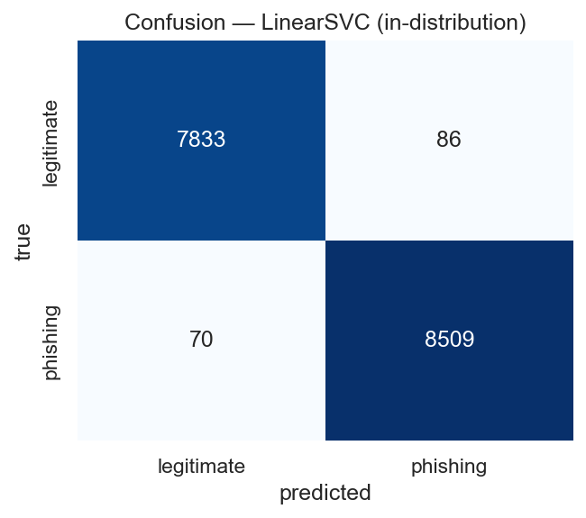
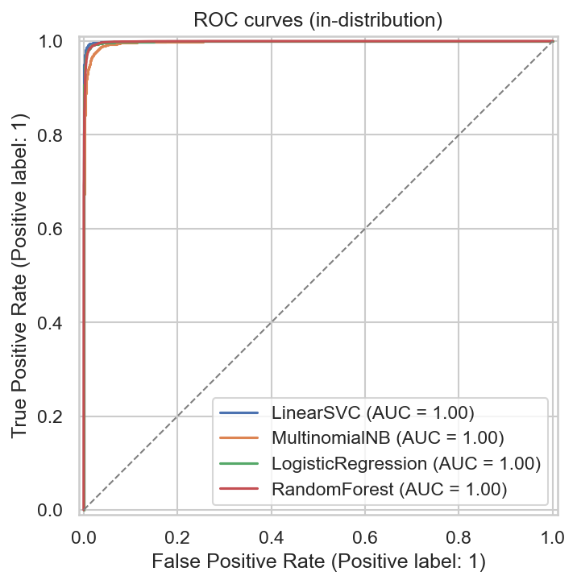
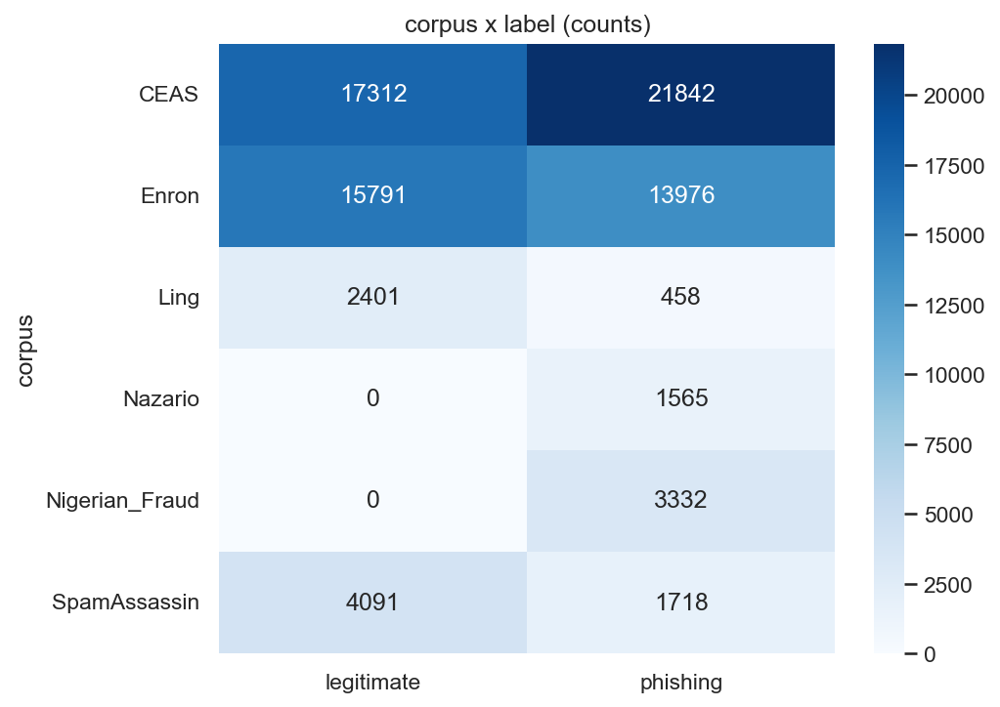
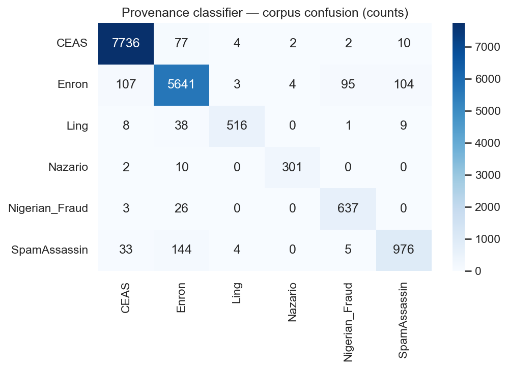
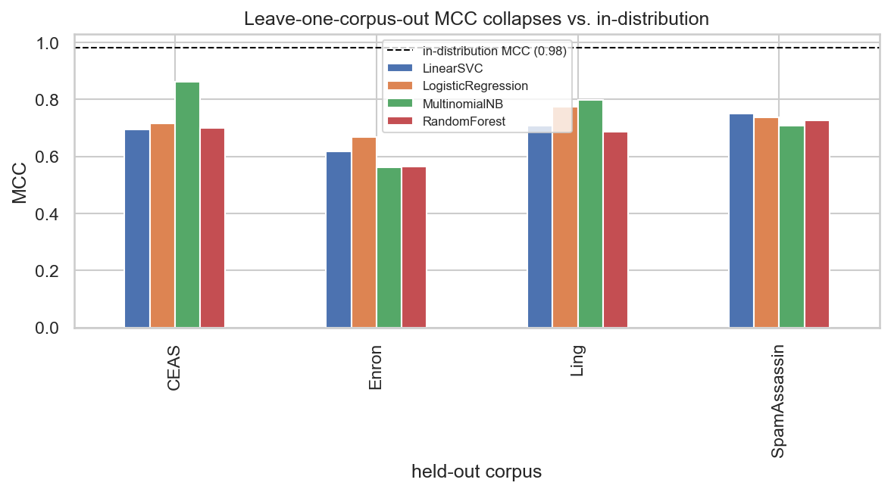
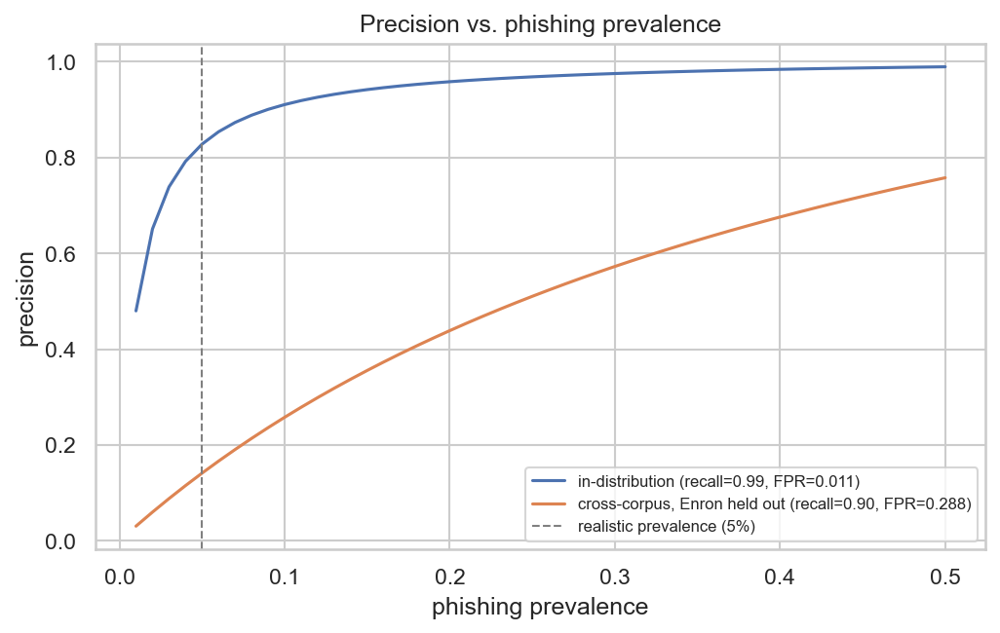

\newpage

# 1. Summary of the Source

**Problem.** Phishing email remains one of the most effective initial-access vectors in
cybersecurity: attackers impersonate trusted senders to harvest credentials or deliver
malware. Automatically classifying an email as *phishing* or *legitimate* from its text is
therefore a long-standing and practically important problem.

**Source under evaluation.** Al-Subaiey, Al-Thani, Alam, Antora, Khandakar, and Zaman,
*"Novel Interpretable and Robust Web-based AI Platform for Phishing Email Detection"*
(arXiv:2405.11619). The paper proposes a lightweight, interpretable pipeline: clean the
email text, vectorize it with **TF-IDF**, and classify with a **Linear Support Vector
Machine**, adding LIME for per-prediction explanations and a small web deployment.

**Why it is a strong target.** One of its authors created the dataset the paper uses, which
has since become a widely reused phishing-email benchmark. The paper reports a headline of
**99.1% accuracy / 0.99 F1** and provides accuracy, precision, recall, and F1 — but **no
MCC, no ROC-AUC, and no cross-corpus or temporal generalization test**. It also publishes no
training code. This combination — a quotable, reproducible claim built on a popular benchmark,
with a metric and evaluation-protocol gap — makes it an ideal subject for critical evaluation.

**Dataset.** The "Phish No More" dataset (Kaggle: `naserabdullahalam/phishing-email-dataset`)
merges six well-known research corpora into **82,486 emails (42,891 phishing / 39,595
legitimate)**: Enron-Spam and Ling-Spam (each containing both ham and spam), CEAS-08 and
SpamAssassin (both classes), and the phishing-only Nazario and Nigerian-Fraud corpora.

**Methodology employed (by the authors).** A single pooled, stratified train/test split;
TF-IDF features; a Linear SVM; accuracy-led reporting.

\newpage

# 2. Critical Evaluation

> *This is the core of the report: whether the author's claims are supported, whether the
> methodology is appropriate, and whether the conclusions are justified.*

## 2.1 The main claim and whether the evidence supports it

The central claim is that TF-IDF + a Linear SVM yields an **effective phishing detector**,
evidenced by **99.1% accuracy / 0.99 F1**. We reproduced the pipeline faithfully (TF-IDF +
`LinearSVC`, stratified 80/20 split, fixed seed) and obtained **accuracy 0.9905, F1 0.9909**
— a near-exact match. Crucially, the metrics the authors omitted are *also* strong on this
split: **MCC 0.9811, ROC-AUC 0.9994**. We confirmed this is not a single-model artifact: all
four models we trained land in the same region (Table 1).

**So the claim is reproducible and internally valid.** The problem is not that the number is
wrong; it is what the number is taken to *mean*.

## 2.2 Is the evaluation methodology appropriate?

We argue it is not sufficient to support the conclusion of real-world efficacy, for three
reasons, each of which we substantiate experimentally in §5.

1. **A single pooled, balanced, random split.** The test set is $\approx$ 52% phishing. A real inbox
   is overwhelmingly legitimate (commonly a few percent phishing). Accuracy on a balanced set
   is therefore optimistic, and *no* experiment in the paper measures performance on an email
   **source not seen during training** — the situation any deployed detector actually faces.

2. **Accuracy-centric metrics.** On imbalanced, rare-event problems (the security norm),
   accuracy is the wrong headline (course: *Goodness of Fit*). MCC, ROC-AUC, and
   prevalence-adjusted precision are exactly the metrics that would expose the gaps — and they
   are absent.

3. **What the model can learn instead of phishing.** Because the dataset stitches together
   distinct corpora, the text carries strong *source* signal (sender domains, business jargon,
   campaign boilerplate). A model can score well by learning *which corpus* an email resembles
   rather than *whether it is phishing*.

## 2.3 Weaknesses and limitations (substantiated in §5)

- **No generalization test.** Under leave-one-corpus-out, MCC falls from $\approx$ 0.98 to **0.56–0.86**
  on unseen mixed corpora, and **recall on the unseen Nazario corpus drops to 0.26–0.48** —
  i.e. a "99%" detector misses roughly half (or more) of phishing from a new source. The
  collapse is **model-agnostic** (all four models), so it is a property of the data/task.
- **Source leakage.** A classifier predicts the *corpus* from text at **95.8% accuracy**, and
  the legitimate-leaning TF-IDF tokens of the reproduced model are dominated by **Enron/
  business artifacts**, not phishing semantics.
- **Temporal fragility.** Within the dated CEAS corpus, training on the past and testing on
  the future drops MCC to **0.66** versus **0.995** for a random split.
- **Prevalence blindness.** At a realistic 5% phishing prevalence, the cross-corpus model's
  precision falls to **0.14** (most alerts would be false alarms).
- **Reproducibility gap.** No training code is released (see §4).

## 2.4 Are the conclusions justified?

The author's *measurement* ($\approx$ 99% on this split) is valid and reproducible. The author's
*conclusion* — that this constitutes an effective, deployable phishing detector — is **not
justified by the evidence presented**, because the evaluation never tests the conditions under
which the conclusion would have to hold (unseen sources, realistic prevalence, temporal drift).
When we add those tests, performance degrades substantially. This is the textbook gap between
a claim that is *true on the benchmark* and a conclusion that is *false in deployment*.

\newpage

# 3. Feature Engineering Analysis

**Was feature engineering performed?** Yes. The source represents each email as a **TF-IDF**
vector over the cleaned subject+body text. We reproduce this and add an interpretable
hand-feature set for analysis.

**Transformations applied and why.**

- **TF-IDF** ($\text{tfidf}(t,d)=\text{tf}(t,d)\cdot\log\frac{N}{n_t}$) with sublinear term
  frequency, English stop-word removal, and a 20k-term cap. *Why:* it down-weights ubiquitous
  tokens and up-weights rare discriminative ones, and TF-IDF rows are L2-normalized, so no
  further scaling is needed for the linear models. *Effect:* it is the representation that
  produces the headline result.
- **Interpretable hand-features** (message length, URL count, urgency-lexicon hits,
  exclamation count, uppercase ratio). *Why:* to compare phishing vs. legitimate distributions
  (§5/EDA) and to expose that several of these are **corpus-correlated**. *Effect:* they carry
  only **weak, mixed** signal — the largest label correlation is message length (Spearman
  $\rho \approx -0.28$, i.e. phishing tends *shorter*), with exclamation count next ($0.25$),
  while URL and urgency counts are essentially uncorrelated with the label — so they explain
  neither the success nor the failure on their own.
- **Dimensionality reduction for visualization (LSA + t-SNE).** A plain 2-component SVD
  captures under 3% of the variance and collapses everything into one blob, so for a faithful
  2-D view we compress to 50 LSA dimensions and then apply **t-SNE**. *Effect:* the t-SNE shows
  rich structure with recognizable corpus clusters (Nigerian-Fraud is tightly separated; Enron
  and CEAS overlap). The class-colored view also shows structure — the classes are strongly
  separable in-distribution — so the projection *motivates* the leakage concern, which the
  provenance classifier and leave-one-corpus-out test then establish rigorously. We do not feed
  reduced features to the models, since linear models thrive on the sparse high-dimensional space.

**Redundancy — how we spot and handle it.** Highly correlated or duplicate features add no
information and can destabilize models and explanations (course: *Explainability*, VIF). We
check redundancy two ways: a **Spearman correlation matrix** over the hand-features — which
flags `char_count` and `word_count` as near-duplicates ($\rho \approx 0.97$, so we would keep
only one) and `url_count`/`upper_ratio` as moderately related ($0.58$) — and a check for
**duplicated text bodies** (which would leak across the split; flagged in
`KNOWN_LIMITATIONS.md`). The remedy where redundancy matters is to drop/merge the signal or
watch VIF — but these hand-features are **diagnostic only** (the models use TF-IDF, not these
columns), so it never enters an estimator; if it did, we would keep one of the
`char_count`/`word_count` pair.

**Was the process meaningful — mathematically and for cyber?** TF-IDF is the right tool for
sparse text, and the hand-features operationalize known phishing tells (urgency, links,
SHOUTING) — though here it is **length** and **punctuation**, not links or urgency, that
separate the classes. The key insight is *negative*: the top "legitimate" tokens are
organizational identity markers (`enron`, desk abbreviations), **not** generalizable phishing
signals — a feature-engineering "success" that is really source memorization.

**Additional features that could help.** Header/auth signals (SPF/DKIM/DMARC, sender-domain
reputation, reply-to mismatch), URL structure (domain age, homoglyph distance, redirect
chains), and HTML structure (forms, hidden text) — these encode phishing *mechanics* rather
than corpus identity, the natural route to a detector that generalizes.

\newpage

# 4. Reproducibility Analysis

- **Can the code be executed?** The source **does not publish training code**, only the
  dataset, a described pipeline, and a web demo. We therefore **re-implemented** the pipeline
  from the description (TF-IDF + `LinearSVC`, $\approx$ 20 lines) and **reproduced the headline almost
  exactly** (0.9905 vs 0.991 accuracy). The *claim* is reproducible; the *artifact* is not
  directly runnable.
- **Are files and dependencies available?** The dataset is freely available on Kaggle (free
  login). Our own environment is fully pinned (`requirements.txt`, Python 3.11) and the data
  is fetched by a script (`src/data.download_data`).
- **Hidden preprocessing?** The paper's text cleaning is described only at a high level; we
  used a standard subject+body concatenation with TF-IDF's built-in lowercasing/stop-words.
  Minor differences here are the most likely source of the $\approx$ 0.01 accuracy gap — and we
  **bound** that: across standard preprocessing variants (stop-words on/off, n-gram range,
  `min_df`, vocabulary size) accuracy stays within a narrow band (notebook §4.1), so the gap is
  well within preprocessing noise rather than a sign of an irreproducible result.
- **Overall reproducibility.** *Moderate.* The result reproduces, but the absence of released
  code and exact preprocessing means independent reproduction relies on reasonable
  reconstruction — itself a limitation worth noting for a paper proposing a deployable platform.

\newpage

# 5. Experimental Results

All experiments use a fixed seed (42), a stratified split, and one shared evaluation protocol
(`src/evaluate.py`). Figures are generated by the notebook into `figures/`.

## 5.1 Reproduction and model comparison (in-distribution)

**Table 1 — In-distribution performance (pooled stratified 80/20).**

| Metric | LinearSVC | LogReg | MultinomialNB | RandomForest |
|:---|---:|---:|---:|---:|
| Accuracy | **0.9905** | 0.9867 | 0.9711 | 0.9851 |
| Precision | 0.9900 | 0.9844 | 0.9857 | 0.9891 |
| Recall | 0.9918 | 0.9901 | 0.9584 | 0.9823 |
| F1 | 0.9909 | 0.9872 | 0.9719 | 0.9857 |
| F2 | 0.9915 | 0.9889 | 0.9637 | 0.9836 |
| MCC | 0.9811 | 0.9733 | 0.9427 | 0.9703 |
| ROC-AUC | 0.9994 | 0.9989 | 0.9969 | 0.9986 |

The Linear SVM reproduces the paper's claim, and **all four models** are strong — including
the omitted MCC/ROC-AUC. The claim is reproducible and not model-specific.

{width=55%}

{width=60%}

## 5.2 Experiment 1 — Corpus$\leftrightarrow$label confound

**Cramér's V(corpus, label) = 0.306** — a moderate association. Corpus is *not* a perfect
proxy for label, so the trivial "it only detects the corpus" story is **rejected**. The
argument must be about generalization, not a single confounded variable.

{width=55%}

## 5.3 Experiment 2 — Provenance is recoverable from text

A multiclass Linear SVM predicts the **corpus** (six classes) from text at **95.8% accuracy
(macro-F1 0.935)**. The corpora are nearly perfectly separable by vocabulary — the foothold
that lets a label classifier lean on source identity.

{width=60%}

## 5.4 Experiment 3 — Token autopsy

Both sides of the model's vocabulary are dominated by **artifacts rather than phishing
semantics**. The most *legitimate*-leaning tokens are Enron identity terms (`enron`, personal
names such as `vince`/`louise`, energy-trading jargon) — "legitimate" largely means "looks
like the Enron corpus." Tellingly, the top *phishing*-leaning tokens are **era and campaign
artifacts too** — calendar years (`2004`, `2005`) and corpus-specific spam tokens (`sightings`,
`monkey`, `jose`) — with only a couple of genuinely phishing-like words (`click`, `remove`).
The model is keying on *when* and *where* an email is from far more than on phishing language:
source (and era) memorization, not phishing detection.

## 5.5 Experiment 4 — Leave-one-corpus-out (the decisive test)

Training on every corpus but one and testing on the held-out (unseen) source:

**Table 2 — Cross-corpus MCC (vs. in-distribution MCC $\approx$ 0.98).**

| Held-out | LinearSVC | LogReg | MultinomialNB | RandomForest |
|---|---|---|---|---|
| CEAS | 0.70 | 0.72 | 0.86 | 0.70 |
| Enron | 0.62 | 0.67 | 0.56 | 0.56 |
| Ling | 0.71 | 0.78 | 0.80 | 0.69 |
| SpamAssassin | 0.75 | 0.74 | 0.71 | 0.73 |

**Table 3 — Cross-corpus recall on phishing-only corpora.**

| Held-out | LinearSVC | LogReg | MultinomialNB | RandomForest |
|---|---|---|---|---|
| **Nazario** | 0.47 | 0.48 | 0.26 | 0.36 |
| Nigerian_Fraud | 0.99 | 0.99 | 0.98 | 0.97 |

MCC collapses from $\approx$ 0.98 to **0.56–0.86** on unseen mixed corpora, **consistently across all
four model families**. On Nazario, every model **misses 52–74% of phishing** from that unseen
source. The honest nuance: Nigerian-Fraud generalizes well — so the finding is not "the model
is broken" but "performance is strongly source-dependent, and the headline hides it."

{width=70%}

## 5.6 Experiment 5 — Temporal generalization (within CEAS)

CEAS-08 ships with corrupt timestamps (years ranging 1980–2100), so we first restrict it to a
plausible window (2007–2009), then train on the earliest 80% by date and test on the latest 20%:

| Metric | Temporal (past$\rightarrow$future) | Random split (same sizes) |
|---|---|---|
| Accuracy | 0.809 | 0.999 |
| Recall | 0.629 | 0.999 |
| F1 | 0.764 | 0.999 |
| MCC | 0.657 | 0.997 |

Temporal evaluation reveals **drift** that a random split entirely hides (MCC 0.66 vs 0.997).
Caveat: era and corpus are entangled in this dataset, so this within-corpus test is the
cleanest temporal signal available.

## 5.7 Experiment 6 — Honest evaluation at realistic prevalence

Recall and FPR are prevalence-independent, so precision can be re-expressed at any base rate
$\pi$: $\;P=\frac{\text{recall}\cdot\pi}{\text{recall}\cdot\pi+\text{FPR}\cdot(1-\pi)}$.

| Phishing prevalence | Precision (in-distribution) | Precision (cross-corpus, Enron held out) |
|---|---|---|
| 5% | 0.83 | **0.14** |
| 10% | 0.91 | 0.26 |

In-distribution precision is robust *because the in-distribution FPR is tiny*. Out of
distribution the FPR rises, and at realistic prevalence precision collapses to 0.14 — i.e.
$\approx$ 86% of alerts would be false alarms. The two stresses (unseen source + realistic prevalence)
compound.

{width=65%}

## 5.8 Error Analysis

On the in-distribution test set the reproduced LinearSVC produces **86 false positives**
(legitimate mail blocked) and **70 false negatives** (phishing missed). False negatives are
the security-critical failures and are typically **obfuscated** phishing (character-mangled
subjects, JavaScript pop-under payloads); false positives are often marketing or
politically-charged legitimate mail that lexically resembles spam. Errors concentrate in the
corpora whose style is least represented — echoing the generalization story. Because the FP/FN
balance is a threshold decision, threshold-independent (ROC-AUC) and recall-weighted ($F_\beta$)
metrics belong in the evaluation; accuracy alone is insufficient.

**Metric definitions (and cyber meaning).** With TP/FP/TN/FN:

- $\text{Precision}=\frac{TP}{TP+FP}$ — of mail flagged as phishing, the fraction truly
  phishing; low precision means blocking legitimate mail (productivity/trust cost).
- $\text{Recall}=\frac{TP}{TP+FN}$ — of phishing, the fraction caught; low recall means phishing
  reaches inboxes (the dangerous miss).
- $F_1=\frac{2PR}{P+R}$; $\;F_\beta=(1+\beta^2)\frac{PR}{\beta^2 P+R}$ ($\beta=2$ weights recall,
  appropriate when a miss is costlier than a false alarm).
- $\text{MCC}=\frac{TP\cdot TN-FP\cdot FN}{\sqrt{(TP+FP)(TP+FN)(TN+FP)(TN+FN)}}$ — a balanced
  truth/prediction correlation robust to imbalance.
- **ROC-AUC** — threshold-independent ranking quality (1 = perfect, 0.5 = chance).
- **Accuracy** — reported only for comparability with the source; misleading under imbalance.

\newpage

# 6. Conclusions

**Key findings.** The paper's 99% claim is **reproducible** and even survives the metrics it
omitted *in-distribution*. But it does **not generalize**: cross-corpus MCC collapses to
0.56–0.86 (model-agnostic), recall on an unseen phishing corpus falls to 0.26–0.48, temporal
evaluation reveals drift (MCC 0.66 vs 0.995), and at realistic prevalence cross-corpus
precision drops to 0.14. The model substantially encodes **source identity** (corpus
predictable at 95.8%; legitimate tokens are Enron artifacts).

**Lessons learned.** (1) On rare-event security problems, accuracy on a balanced pooled split
is a misleading headline — MCC/ROC-AUC and prevalence-adjusted precision are essential.
(2) When a dataset is assembled from distinct corpora, in-distribution scores can reflect
source separability rather than the target concept; **cross-source evaluation is mandatory**.
(3) Train-on-past/test-on-future matters for an evolving threat.

**Strengths of the source.** A clean, interpretable, genuinely reproducible pipeline on a
useful benchmark; a reasonable baseline and a good teaching example.

**Weaknesses.** Evaluation protocol (single balanced split, no cross-source/temporal test),
accuracy-centric reporting, source leakage, and no released code.

**Future improvements.** Cross-corpus and temporal validation as standard; imbalance- and
prevalence-aware metrics; phishing-*mechanic* features (headers/auth results, URL structure,
HTML) instead of corpus-correlated vocabulary; and de-duplication checks.

\newpage

# 7. Executive Summary

We critically evaluated a published phishing-email detector (arXiv:2405.11619) that reports
**99.1% accuracy** with TF-IDF + a Linear SVM on the six-corpus "Phish No More" benchmark. We
reproduced the result almost exactly (accuracy 0.9905, F1 0.9909) and confirmed it across four
model families, including the MCC/ROC-AUC the authors omitted — so the claim is genuinely
reproducible *in-distribution*. We then tested what the paper did not: generalization to unseen
email sources, temporal drift, and realistic class prevalence. Under leave-one-corpus-out,
MCC collapses from $\approx$ 0.98 to 0.56–0.86 and recall on the unseen Nazario corpus falls to
0.26–0.48 — model-agnostic, so it is a property of the data, not the classifier. A provenance
classifier predicts the corpus from text at 95.8% accuracy, and the model's "legitimate" tokens
are Enron/business artifacts: the detector substantially learned *which corpus* an email
resembles, not *whether it is phishing*. Within the dated CEAS corpus, temporal evaluation
drops MCC to 0.66 (vs 0.995 random), and at a realistic 5% prevalence cross-corpus precision
falls to 0.14. **Verdict: the claim is reproducible, but the conclusion of real-world efficacy
is overstated.** We do not recommend deploying the pipeline on a new email population on the
strength of its headline accuracy; as a reproducible baseline and a case study in evaluation
pitfalls, however, it is instructive.

\newpage

# 8. Summing It Up

- **Problem.** Detecting phishing emails from text.
- **Source.** Al-Subaiey et al., arXiv:2405.11619 (TF-IDF + Linear SVM; 99.1% accuracy).
- **Dataset.** "Phish No More" — six merged corpora, 82,486 emails (42,891 phishing / 39,595
  legitimate); most corpora contain both classes.
- **Methodology of our study.** Faithful reproduction, then a six-experiment critique:
  confound quantification, provenance classifier, token autopsy, leave-one-corpus-out across
  four models, within-corpus temporal split, and prevalence-adjusted re-evaluation, plus error
  analysis.
- **Main findings.** Reproduced $\approx$ 99% in-distribution (MCC 0.98, ROC-AUC 0.999); cross-corpus
  MCC 0.56–0.86 and Nazario recall 0.26–0.48 (model-agnostic); provenance recoverable at
  95.8%; temporal MCC 0.66 vs 0.995; cross-corpus precision 0.14 at 5% prevalence.
- **Were the author's claims supported?** The *accuracy claim*: yes, reproducibly, in
  distribution. The *conclusion of effective detection*: no — it does not generalize.
- **Most important insight.** In-distribution accuracy on a multi-corpus benchmark can measure
  source separability rather than phishing detection; only cross-source, prevalence-aware
  evaluation reveals real-world performance.
- **Recommendation for similar problems.** Useful as a reproducible baseline and a teaching
  case, but **not** as deployment evidence; always add cross-source/temporal validation and
  imbalance-aware, prevalence-adjusted metrics.
- **Final conclusion.** A reproducible number, an overstated conclusion — a clean illustration
  of the difference between performing well on a benchmark and detecting the intended concept.
